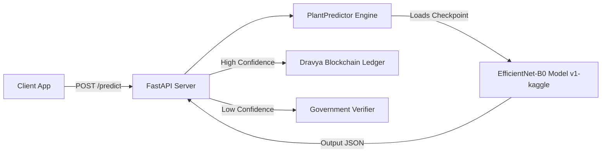

# Dravya AI Engine — Quick Technical Reference Guide

> **Quick Reference Guide** | 1-2 Page Technical Cheat Sheet  
> **Repository:** `Dravya-Ayurvedic-Blockchain-Platform/AI-Engine`  

---

## 1. What Dravya AI Engine Does
**Dravya AI Engine** is a PyTorch and FastAPI-powered microservice for **Ayurvedic medicinal plant classification**. It receives raw field photos of leaves/herbs and returns structured JSON predictions containing predicted species name, scientific botanical taxonomy, canonical class ID, and top-5 confidence scores.

---

## 2. System Architecture



---

## 3. Dataset & Data Pipeline
- **Sources:** CIMPd, Hugging_Face, Kaggle datasets (treated as 100% read-only).
- **Data Cleanliness:** SHA-256 duplicate detection isolates duplicate image hashes before train/test splitting.
- **Harmonization:** Maps raw labels to 82 canonical plant species (`DRAVYA_0022` = *Aloe vera*).
- **Human Review:** Append-only review history (`taxonomy_review_history_v1.json`) for taxonomy verification.

---

## 4. Active Production Model (`v1-kaggle`)
- **Backbone Architecture:** `EfficientNet-B0` (PyTorch 2.13)
- **Input Size:** `224 x 224 x 3` (RGB)
- **Number of Classes:** `82` species
- **Model Checkpoint Size:** `16.75 MB` (`models/v1-kaggle/best_model.pth`)
- **Pointer File:** `models/active_model.json` -> `"active_version": "v1-kaggle"`

---

## 5. Evaluation & Performance Metrics
- **Test Set Size:** 2,256 dedicated images
- **Correct Predictions:** 2,226 images
- **Overall Test Accuracy:** **98.67%**
- **Best Validation Accuracy:** **99.33%**
- **Inference Latency:** ~45 ms per image (CPU)

---

## 6. FastAPI Endpoints & Contracts

### `POST /predict`
- **Request:** Form-data with file payload (`file` or `image`). Max size: 10 MB.
- **Allowed Formats:** JPEG, PNG, WebP, BMP.
- **Response:**
```json
{
  "model_version": "v1-kaggle",
  "class_id": "DRAVYA_0022",
  "predicted_class": "Aloe vera",
  "species_name": "Aloe vera",
  "scientific_name": "Aloe barbadensis",
  "confidence": 0.9845,
  "top_k": [...]
}
```

### `GET /health`
- **Response:** `{"status": "healthy", "model_version": "v1-kaggle", "model_loaded": true}`

---

## 7. Essential Developer Commands

```powershell
# 1. Run Complete End-to-End Verification
python verify_v1_kaggle.py

# 2. Run Automated PyTest Suite (159 tests)
pytest -o pythonpath=. -v tests/

# 3. Start Live FastAPI Server
uvicorn src.api.app:app --host 127.0.0.1 --port 8000 --reload

# 4. Batch Predict Directory of Images
python -m src.inference.batch_predictor --input-dir datasets/sample_images --output reports/batch_predictions.json

# 5. Run Human Review Queue CLI
python -m src.data.run_taxonomy_review_queue --version v1 --session-summary
```

---

## 8. SIH 30-Second Pitch
> "Dravya AI solves species adulteration in Ayurvedic supply chains by providing 98.67% accurate automated identification across 82 medicinal plant species. Powered by EfficientNet-B0 and FastAPI, it verifies visual herb authenticity in 45 milliseconds, sending high-confidence predictions to the Dravya Blockchain ledger and flagging ambiguous samples for government verifiers."

---

## 9. Major Limitations & Status
- **Current Status:** Fully Functional Production Model `v1-kaggle` active.
- **Limitation 1:** Out-of-Distribution (OOD) unknown plant rejection thresholding is PLANNED.
- **Limitation 2:** Grad-CAM visual explainability overlays are PLANNED.
